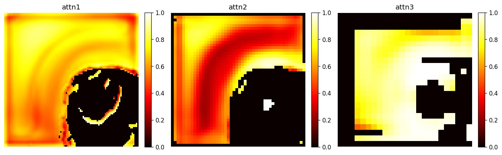

# BraTS 3D Glioma Segmentation (Project SOUL)

3D brain tumor segmentation pipeline for BraTS-style labels using a V2 attention U-Net with deep supervision, ensemble inference, and sliding-window full-volume prediction.

- **Primary task:** multiclass segmentation with classes `{0,1,2,3}` (background, NCR/NET, edema, ET)
- **Current active line:** `UNet3DAttnV2` (V1 is legacy)
- **Data strategy:** patch-based training on mixed BraTS 2020 + 2023 preprocessed `.npz` files
- **Inference strategy:** fold checkpoint ensemble + optional TTA + sliding-window stitching

## Why this project is interesting

- Trains on **consumer-GPU-friendly 3D patches** while keeping full-volume inference available.
- Uses **Dice + weighted CE + optional boundary loss** for class imbalance and sharper borders.
- Supports **deep supervision** and configurable architecture width (`base`) for VRAM-aware tuning.
- Includes **case-level metric aggregation**, BraTS composites (WT/TC/ET), and HTML reporting.
- Ships with practical scripts for preprocessing, training, inference, visualization, and export.

## Architecture at a glance

### Model (`training/core/model.py`)
- 3D U-Net with attention-gated skips and residual-style convolution blocks.
- 5 encoder levels in V2 with decoder-side deep supervision heads.
- Training returns main logits + DS outputs (and optional DSD branch); inference returns main logits.

### Training engine (`training/engine/train_engine.py`)
- AMP (bf16 on CUDA), gradient accumulation, gradient clipping.
- Early stopping by foreground Dice.
- Checkpointing for `last.pt` and best fold model (`fold_N_best.pt`).
- NaN/Inf safeguards and run-state persistence for resume.

### Inference stack (`inference/`)
- `predict.py`: ensemble loading and patch inference.
- `sliding_window.py`: full-volume NIfTI prediction with Gaussian overlap blending.
- `evaluate.py`: patch/case evaluation and HTML report generation.
- `attention_viz.py` and `visualize.py`: qualitative inspection helpers.

## End-to-end flow

1. **Preprocess data** into standardized `.npz` patches.
2. **Train V2 folds** with reproducible split logic and checkpointing.
3. **Run inference** on patches or full NIfTI volumes.
4. **Evaluate** with Dice + BraTS composites + HD95.
5. **Inspect outputs** via reports and visual artifacts.

## Repository layout

```text
E:\data\
├── training/                  # Model, losses, dataloaders, training engine, run scripts
├── inference/                 # Prediction, sliding window, evaluation, visualization, export
├── scripts/                   # Data preprocessing utilities
├── models/v2/                 # Best V2 checkpoints
├── outputs/                   # Curated demo outputs (report/visual examples)
└── requirements.txt
```

## Quick start

### 1) Install dependencies
```powershell
cd E:\data
E:\data\.venv\Scripts\python.exe -m pip install -r requirements.txt
```

### 2) Train one fold (V2)
```powershell
cd E:\data\training
E:\data\.venv\Scripts\python.exe runs\v2_5fold.py --fold 1
```

### 3) Inference on a patch
```powershell
cd E:\data
.venv\Scripts\python.exe inference\predict.py "patches\val\some_patch.npz" --device cuda
```

### 4) Full-volume inference (NIfTI)
```powershell
.venv\Scripts\python.exe inference\sliding_window.py volume.nii.gz --output seg.nii.gz --stride 24
```

### 5) Evaluation + report
```powershell
.venv\Scripts\python.exe inference\evaluate.py --max 100 --report --extended
```

Use the commands above as the primary quick-start workflow.

## Visuals and sample outputs

- **Attention/qualitative view:** `outputs/attention.png`
- **Evaluation report:** `outputs/eval_report.html`
- **Example prediction artifact:** `outputs/my_result.npz`

Preview image:



## Important operational notes

- Keep train/inference architecture width aligned:
  - training uses `MODEL_BASE` (run config),
  - inference uses `V2_CONFIG["base"]` in `inference/predict.py`.
- `fold_N_best.pt` is the primary checkpoint for ensemble inference.
- Sliding-window inference is recommended for full MRI volumes; patch inference is mainly for fast checks.
- If you change path assumptions (e.g., from `E:\data`), update scripts/configs consistently.

## What’s next (roadmap highlights)

- Finalize a single production-grade model profile.
- Improve report exports (CSV/JSON and richer metric tables).
- Add stricter case-level CV option when needed.
- Package inference behind an API after model freeze.
